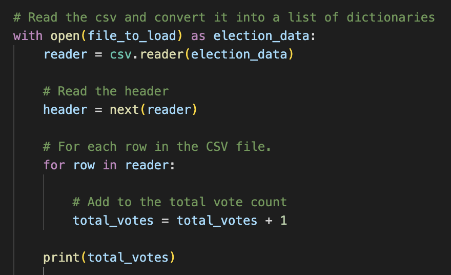

# Election_Analysis

## Overview of Election Audit

The purpose of this election audit was to automate the task of reporting the total number of votes cast, the total number of votes for each candidate and a few other key factors for the tabulated results for the U.S. congressional precinct in Colorado. 

After analyzing the election data using Python and automating result generation, Tom and the team requested some additional data to be reported to finalize the audit. 

## Election-Audit Results

### How many votes were cast in this congressional election?

There were a total of 369,711 total votes cast in this congressional election. The code to generate this number can be found below: 

### Provide a breakdown of the number of votes and the percentage of total votes for each county in the precinct.

A large majority of the votes came from the county of Denver, followed by a fraction of the remaining votes coming from Jefferson and the least amount of votes from the county of Araphoe. 

See the following number of votes and percentage of the total votes for each county in the precinct in order from greatest to least. 

Denver: 82.8% (306,055)
Jefferson: 10.5% (38,855)
Arapahoe: 6.7% (24,801)

### Which county had the largest number of votes?

Denver county had the largest number of votes. 

### Provide a breakdown of the number of votes and the percentage of the total votes each candidate received.

Diana DeGette recieved the majority of the votes - almost three quarters to be exact. Following her is Charles Casper Stockham with about a quarter of the votes and finally Raymon Anthony Doane with just 3.1% of the total votes. 

See the following number of votes and percentage of the total votes for each candidate in the precinct in order from greatest to least. 

Diana DeGette: 73.8% (272,892)
Charles Casper Stockham: 23.0% (85,213)
Raymon Anthony Doane: 3.1% (11,606)

### Which candidate won the election, what was their vote count, and what was their percentage of the total votes?

Diana DeGette won the election by popular vote. Their vote count was 272,892 which tallies up to 73.8% of the total votes cast in this election. 

## Election Audit Summary

This script can be used for any election given that the data is formatted in a similar manner in the csv file. However, this script can also be modified in a couple of ways to improve versatility. 

First, we can add a column for the year of the election - potentially if we want to see how the data changes from year over year and if the county turnout is similar between elections. Thus allowing us to use it for other elections. 

Secondly, we could add an analysis of how voters from each county voted. For example, all of one of the candidates votes could be coming from just one county - potentially Raymon Anthony Doane is really popular in Jefferson, but we are missing out on that data by not tracking it. Doing this would allow this script to be used for other elections if there are multiple counties and candidates. 

